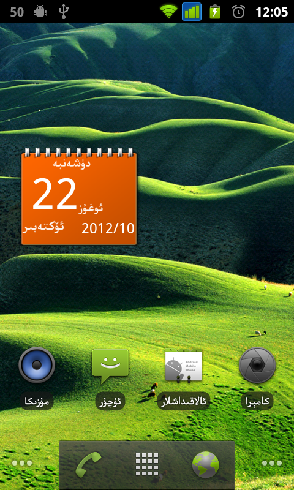
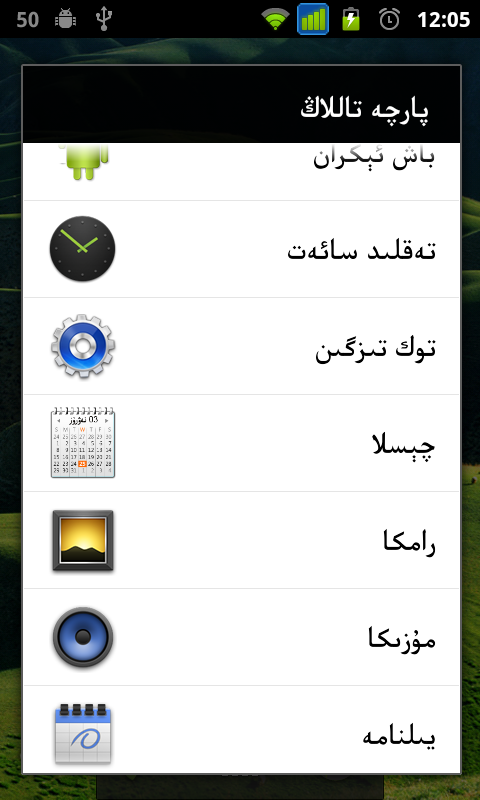

Calendar
========

This app (a widget, actually) displays the system calendar on the home screen in Uyghur language.

سىستىمىنىڭ چىسلاسىنى ئىكران يۈزىدە كۆرسىتىپ بىرىدىغان پروگراممىچاق. 
ئىقتىدارى: سىستىمىنىڭ چىسلاسىنى كۆرسىتپ بىرىش، ماس كىلىدىغان ئۇيغۇرچە ئاي ناملىرى، ھەپتە، كۈن ناملىرنى كۆرسىتىپ بىرىش.

Screenshots:
---------

Download link:
---------
* [Download from Google Play](https://play.google.com/store/apps/details?id=net.uyghurdev.chisla.re)

* [Download from Bilkan Bazar](http://bazar.bilkan.net/App.aspx?id=172)

Used Open Source Projects:
---------
* [Arabic Reshaper](https://github.com/AZIZHUSS/Arabic-Reshaper)
